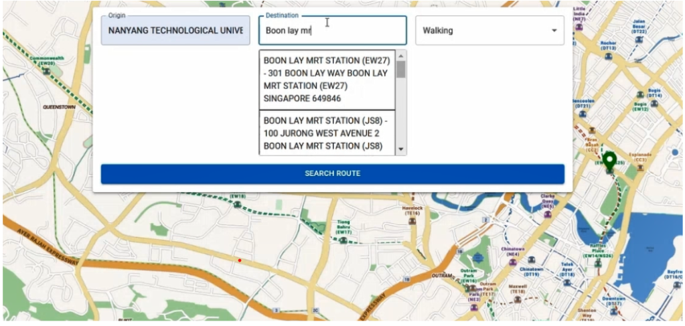

# SC2006 Software Development Project - Map Application

This is the repository for our **SC2006 Software Development Project**. The application is a **Map App** that integrates **Google Maps**, **OneMap**, and other  APIs by **LTA DataMall** to provide real-time information about routes, bus timings, parking availability, and weather markers. The project utilizes **React.js** for the frontend and **Python FastAPI** for the backend.

## Project Overview

The main goal of the project is to provide a comprehensive and interactive map application by leveraging government APIs and other services. The application provides the following features:

- **Dynamic Route suggestions** with real-time updates.
- **Live Bus timings** and arrival information, constantly refreshed.
- **Real-time Parking availability** with live occupancy data.
- **Dynamic Weather markers** that fetch live weather data for locations.

## Features

### 1. **Dynamic Route Suggestions**
- Suggests the best routes between user-specified locations using Google Maps and OneMap APIs.
- **Dynamic fetching**: Continuously updates routes in real-time based on current traffic conditions, road closures, and other factors.
- Users can **select their preferred route** from the suggested alternatives.

### 2. **Live Bus Timings**
- Integrates DataMall API to fetch real-time bus arrival timings.
- **Dynamic updates**: The bus timings refresh at regular intervals, ensuring users always see the latest data.
- Displays bus arrival times for nearby bus stops, automatically updating without needing to reload the page.

### 3. **Real-time Parking Availability**
- Retrieves live parking availability in selected areas, fetching data from government sources and parking APIs.
- **Dynamic fetching**: Continuously updates parking occupancy and availability as it changes in real-time.

### 4. **Dynamic Weather Markers**
- Displays weather information at selected locations, including temperature, humidity, and forecast.
- **Live weather updates**: The weather markers update every certain interval to reflect real-time weather data.
- Weather icons and information are provided for better visualization, dynamically updated based on location and weather changes.

### 5. **Frontend (React.js)**
- The frontend is developed using **React.js**, ensuring an interactive and responsive user interface.
- The app dynamically interacts with the backend to fetch real-time data from various external APIs and continuously update it on the map.

### 6. **Backend (FastAPI with Python)**
- The backend is built using **Python FastAPI**, a fast and modern framework.
- The backend handles requests to fetch data from various external APIs, processes it, and sends it to the frontend. It updates the data at set intervals to ensure the frontend has the most current information.
- Redis Database is utilized as a cache to temporarily store and quickly retrieve frequently requested data. This improves performance by reducing the number of API calls to external services, enhancing the responsiveness of the app.

## Technologies Used

- **Frontend**: React.js
- **Backend**: Python FastAPI
- **APIs**: 
  - Google Maps API
  - OneMap API
  - DataMall API
- **Weather API**: Integrated for weather data.
- **Maps API**: Google Maps and OneMap for map display and routing.

## My Contributions

As part of the team, I contributed to the following features:

1. **Dynamic Route Fetching (OneMap API)**:
   - Implemented dynamic route fetching using the OneMap API, ensuring real-time updates for the best routes and allowing users to choose their preferred route from available alternatives.
  
  
  

2. **Live Bus Timings (LTA DataMall API)**:
   - Integrated the LTA DataMall API to fetch real-time bus arrival timings, with automatic refreshing at set intervals to provide users with accurate and up-to-date information.
    

3. **Real-time Parking Availability (LTA DataMall API)**:
   - Developed the feature to fetch and dynamically update real-time parking availability data, providing users with accurate occupancy and available parking spaces in selected areas.
  

4. **Dynamic Weather Markers**:
   - Added functionality to dynamically update weather markers on the map, providing users with live weather data for specific locations, including visual clarity with weather-related icons.
  

5. **Marker Image Integration**:
   - Designed and integrated weather-related marker images (e.g., cloud, rain) for better visualization and enhanced user experience, stored under the `/imgs` directory.

